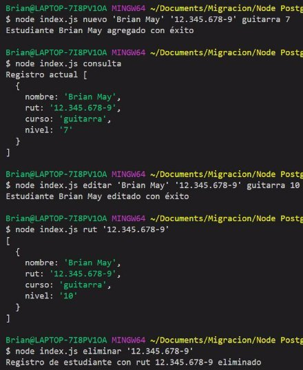
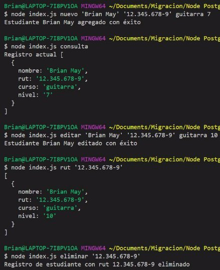
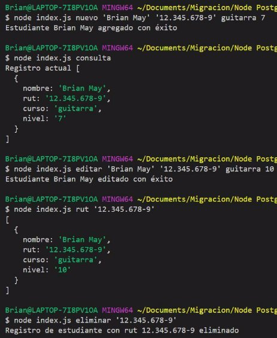
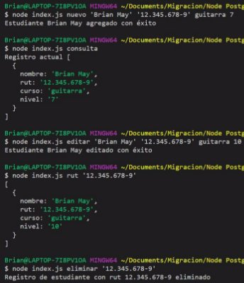



**Desafío - Always Music**

- Para realizar este desafío debes haber estudiado previamente todo el material disponibilizado correspondiente a la unidad.
- Una vez terminado el desafío, comprime la carpeta que contiene el desarrollo de los requerimientos solicitados y sube el .zip en el LMS.
- Desarrollo desafío:

○ El desafío se debe desarrollar de manera Grupal.

Capítulos

El desafío está basado en el siguiente capítulo de la lectura:

- Instalación y configuración de la librería pg
- Propiedades del objeto result y la asincronía en una consulta
- Ingresando y consultando datos
- Actualizando y eliminado datos

Descripción

La escuela de música Always Music es reconocida en la ciudad por graduar a grandes músicos de reconocimiento mundial, sin embargo, a pesar de lo mucho que ha crecido con el tiempo, nunca dejaron de utilizar excel como base de datos y han decidido cambiar esto por un desarrollo personalizado.

En este desafío deberás desarrollar una aplicación en Node que realice consultas a PostgreSQL con el paquete “pg” para:

- Agregar un nuevo estudiante.
- Consultar los estudiantes registrados.
- Consultar estudiante por rut.
- Actualizar la información de un estudiante.
- Eliminar el registro de un estudiante.

Ya que el caso se trata de un proceso de desarrollo, la interacción la debes realizar con argumentos por la línea de comandos.

Antes de iniciar este desafío deberás crear una base de datos y una tabla con las siguientes columnas:

- Nombre
- Rut
- Curso
- Nivel

Usa las siguientes imágenes como referencia de lo que debes lograr en el desarrollo de este desafío.

**Nuevo estudiante:**

**Consulta: **

**Editar estudiante: **

**Consultar por rut:**

**Eliminar registro de estudiante:**

Requerimientos

1. Realizar la conexión con PostgreSQL con la clase Client.
1. Crear una función asíncrona para registrar un nuevo estudiante en la base de datos.
1. Crear una función asíncrona para obtener por consola el registro de un estudiante por medio de su rut.
1. Crear una función asíncrona para obtener por consola todos los estudiantes registrados.
1. Crear una función asíncrona para actualizar los datos de un estudiante en la base de datos.
1. Crear una función asíncrona para eliminar el registro de un estudiante de la base de datos.
   **\_ PAGE3**

www.desafiolatam.com
